```{r setup, include=FALSE}
library(reticulate)
use_python("C:/Users/dream/Anaconda3/python.exe")
```

# Outline

## Part 1
1. Probability notation: Marginal probability, joint probability, conditional probability, Bayes rule
2. Maximum likelihood, Bayesian inference
3. Normalization trick
4. Quiz and programming break(Naive bayes)

## Part 2
5. Graphical model and bayesian network
6. Basic structure of graphical model
7. Programming break (Linear regression)

## Part 3
8. Bayesian inference problem
9. Variable elimination
10. Latent variable
11. EM algorithm
12. Variational inference
13. Sampling method

# Probability notation

## Random variable(RV)

Random variable is a variable that can take difference values in random space. I may denoted RV in a capital letter, for example, X is random variable and lower capital x is the constant values. Note that I may use X and x interchangeably but you can understand it in the context, anyway I try to write as correct as possible.

### Marginal probability

$p(X)$ denotes a marginal probability distribution of X.

Marginal probability is the probability of an event irrespective of the outcome of another variable.

#### Discrete case (Roll dice) 
$p(X)$ ~ $\mathcal{U}(1,6)$


You can call $p(X)$ as probability mass function (pmf).

(The actual notation of pmf is $p(X = x)$)

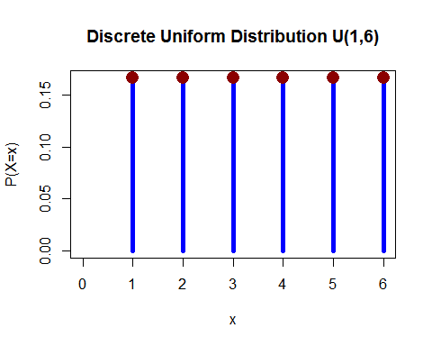{width=500px, height=400px}


#### Continuous case 
 \(p(X)\) ~ $\mathcal{N}(\mu,\sigma)$

You can call p(X) as probability density function (pdf).

(The actual notation of pdf is $p(X = x)$ )

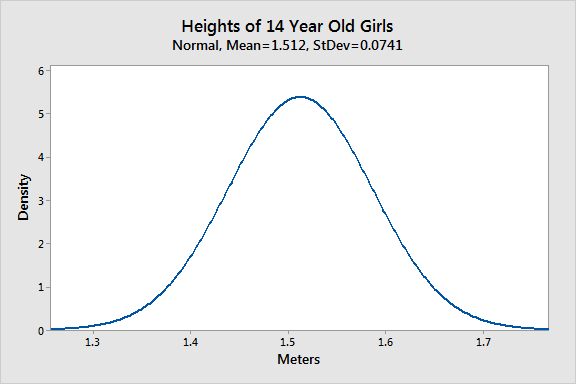{width=500px, height=300px}

### Joint probability

$p(X,Y)$ denoted a joint probability of X and Y

#### Independent 
For example, flip the coin two times, the outcome of second coin not depend on first coin.

x denote for outcome of fliping the first coin

y denote for outcome of fliping the second coin

$$p(X,Y) = p(X)p(Y)$$


#### Dependent
For example, this is the record of cloudy and rain in 30 day

                | model      | Rain | No rain | Total |
                |------------|------|---------|-------|
                | Cloudy     | 10   | 5       | 15    |
                | Not cloudy | 2    | 13      | 15    |
                | Total      | 12   | 18      | 30    |


How do you calculate $p(rain)$ ?

In this case

$$p(rain) = p(rain,cloudy) + p(rain, not cloudy)$$

                | model      | Rain | No rain | Total |
                |------------|------|---------|-------|
                | Total      | 12   | 18      | 30    |

$$p(rain) = \sum_{all \ c} p(rain,C)$$

probability of raining $p(rain)$ is $12/30 = 0.4$ 

probability of cloudy $p(cloudy)$ is $15/30 = 0.5$ 

probability of raining and cloudy $p(rain,cloudy)$ is $10/30 = 0.333$ 

$$p(R,C) \neq p(R)p(C) $$

### Conditional probability
$p(X \mid Y)$  denotes a conditional probability distribution of X conditioned on Y

Let look the rain & cloudy table

                | model      | Rain | No rain | Total |
                |------------|------|---------|-------|
                | Cloudy     | 10   | 5       | 15    |
                | Not cloudy | 2    | 13      | 15    |
                | Total      | 12   | 18      | 30    |
                
$p(R \mid cloudy)$
                
                | model      | Rain | No rain | Total |
                |------------|------|---------|-------|
                | Cloudy     | 10   | 5       | 15    |
                | Total      | 10   | 5       | 15    |

probability of raining in cloudy day $p(rain \mid cloudy)$ is $10/15 = 0.666$

probability of cloudy $p(cloudy)$ is $15/30 = 0.5$

probability of raining and cloudy $p(rain,cloudy)$ is $10/30 = 0.333$

$$Bayes \ Theorem \ \ \ \ \ \  p(R \mid C)p(C)=  p(C \mid R)p(R) = p(R,C)$$

Look at the picture below

Purple color is joint probability $p(A,B)$

Red and Purple color are marginal probability $p(A)$

Blue and Purple color are marginal probability $p(B)$

$$p(A \mid B) = \frac{p(A,B)}{p(B)}$$

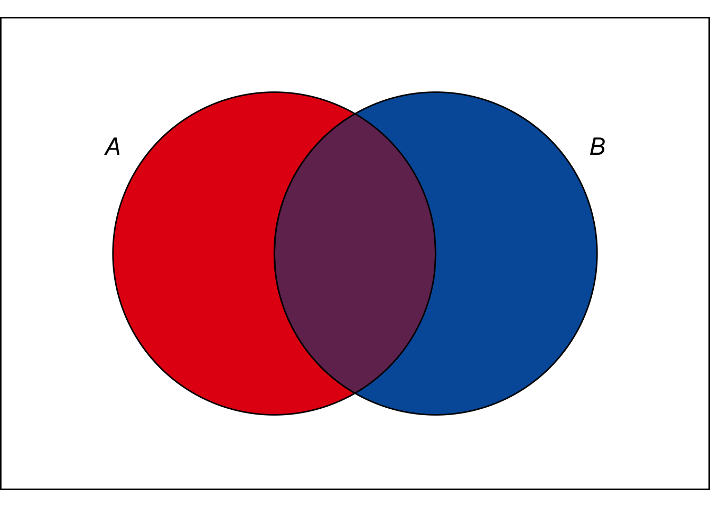{width=500px, height=300px}{width=500px, height=300px}

The Bayes theorem tell how often X happen given that Y happens, written as $p(R \mid C)$

## Maximum likelihood estimation for parameter

For the given probabilistic model $p(X)$ ~ $\mathcal{N}(\mu,\sigma)$ and the given data distribution as below, how do we find the best parameter $\mu$ and $\sigma$ that fit the data.

{width=500px, height=400px}

Because probability of $X = x$ depend on the model parameter $\mu$ and $\sigma$ we can write probability function as $p(X = x; \mu,\sigma)$. 

$p(X = x; \mu,\sigma)$ mean the likelihood of observed $X$ for given model parameter $\mu,\sigma$ 

or we can use notation $L( \mu,\sigma ;X = x)$

And we can get the model parameter $\mu, \sigma$ by find the $\mu,\sigma$ that maximize $L( \mu,\sigma ;X = x)$

$$parameter_{ML} = argmax_{parameter} p(X \mid parameter)$$

## Bayesian Inference

For the maximum likelihood estimation we assume the parameter is not random variable. But in bayesian we assume the model parameter as random variable. 
$p(X,Y) = p(Y,X) \\ p(Y \mid X)p(X) = p(X \mid Y)p(Y)$
 
$$p(Y \mid X) = \frac{p(X \mid Y)p(Y)}{p(X)}$$

$$p(parameter \mid X) = \frac{p(X \mid parameter)p(parameter)}{p(X)}$$

$$Posterior = \frac{Likelihood \ \times \ Prior  }{Evident}$$

Because the evident is just constant ($p(X=x)$)

$$Posterior \propto Likelihood \ \times \ Prior$$

Prior show the probability before we know the data (distribution over possible parameter values)

Likelihood give us a best parameter for given data.

Posterior is the distribution that conbine the information from prior knowledge and the data.

And we can find the best parameter by find the maximum posterior

$$paramater_{MAP} = argmax_{parameter}p(parameter  \mid X)$$

Example : fliping coin

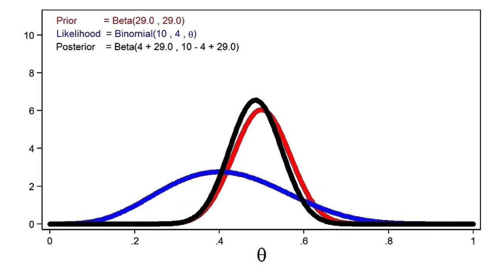{width=500px, height=300px}

## Normalization trick

                | model      | Rain | No rain | Total |
                |------------|------|---------|-------|
                | Cloudy     | 10   | 5       | 15    |
                | Not cloudy | 2    | 13      | 15    |
                | Total      | 12   | 18      | 30    |
                
                | model      | Rain | No rain | Total |
                |------------|------|---------|-------|
                | Cloudy     | 0.333| 0.166   | 0.5   |
                | Not cloudy | 0.066| 0.433   | 0.5   |
                | Total      | 0.4  | 0.6     | 1     |
                
                
We can calculate $p(R \mid cloudy)$ by calculate only $p(R, cloudy)$

                | model      | Rain | No rain | Total |
                |------------|------|---------|-------|
                | Cloudy     | 0.333| 0.166   | 0.5   |

And normalize the table to get $p(R \mid cloudy)$

                | model      | Rain        | No rain       | Total |
                |------------|-------------|---------------|-------|
                | Cloudy     | 0.333/0.5   | 0.166/0.5     | 1     |
                
Because 

$$p(R \mid C = c) = \frac{p(R,C = c)}{p(C = c)}$$

$p(C = c)$ is just constant

$$p(R \mid C = c) \propto p(R,C = c)$$


## Quiz true or false ?

1. $\sum_{all \ x} p(X) = 1$

2. $\sum_{all \ x, all \ y} p(X,Y) \neq 1$

3. $\sum_{all \ x, all \ y} p(X \mid Y) = 1$

4. $argmax_{parameter}p(parameter  \mid X)$ is only depend on $argmax_{parameter}p(X ; parameter)$ sometimes.


## Programming break

In this example we have the data of New China Virus and the symptom of patients. The given data will be look like table below.

                      | Patients number | New China Virus | Fever | Vomitting       |
                      |-----------------|-----------------|-------|-----------------|
                      | 1               | 1               | 1     | 1               |
                      | 2               | 0               | 1     | 0               |
                      | 3               | 1               | 1     | 1               |
                      | 4               | 1               | 1     | 1               |
                      | 5               | 0               | 1     | 1               |
                      | 6               | 0               | 1     | 0               |
                      | 7               | 1               | 0     | 1               |
                      | 8               | 0               | 1     | 0               |
                      | 9               | 1               | 0     | 1               |
                      | 10              | 0               | 1     | 0               |

## Naive bayes

```{python}
import numpy as np

def generate():

  dataset = []
  for i in range(10):
    patient = np.random.randint(0,2, 3)
    dataset.append(patient)
  dataset = np.array(dataset)
  return dataset
  
dataset = generate()
  
```

$$Bayes \ Theorem \ \ \ \ \ \  p(X \mid Y)p(Y) = p(X,Y)$$

$$p(virus \mid fever, vomit) = \frac{p(virus, fever, vomit)}{p(fever, vomit)}$$

Because naive bayes assume independent variable.

$$p(virus \mid fever, vomit) = \frac{p(fever, vomit \mid virus)p(virus)}{p(fever)p(vomit)}$$

$$p(virus \mid fever, vomit) = \frac{p(fever \mid virus)p(vomit \mid virus)p(virus)}{p(fever)p(vomit)}$$


```{python}

print("dataset = \n",dataset)

fever = dataset[:, 1]
virus = dataset[:, 0]
vomit = dataset[:, 2]


p_vomit = vomit.sum()/len(vomit)
p_virus = virus.sum()/len(virus)
p_fever = fever.sum()/len(fever)

dataset_virus_positive = dataset[virus == 1]

print("dataset virus positive = \n" ,dataset_virus_positive)

vomit_virus_pos = dataset_virus_positive[:,2]
fever_virus_pos = dataset_virus_positive[:,1]

p_vomit_condition_virus = vomit_virus_pos.sum()/len(vomit_virus_pos)
p_fever_condition_virus = fever_virus_pos.sum()/len(fever_virus_pos)

posterior = p_vomit_condition_virus*p_vomit_condition_virus*p_virus/p_vomit/p_fever

print( "posterior = ",posterior)


```

Example above you will know that if the patient have fever and come from china the probability that they have virus is the "posterior"

## Graphical models

1. Directed graph
- Bayesian network (today)
- Naive Bayes classifier (today)

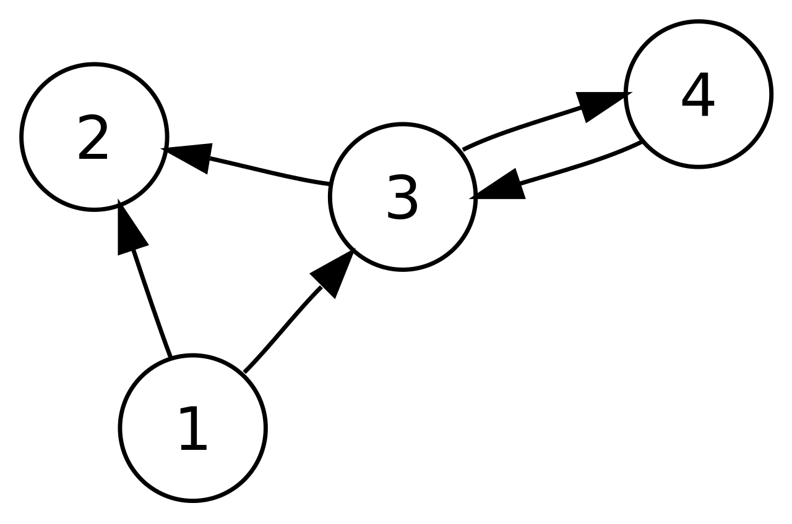{width=500px, height=300px}

2. Undirected graph

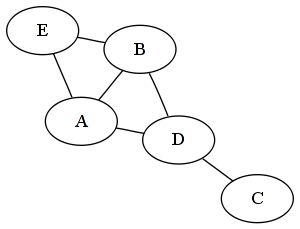{width=500px, height=300px}

## Bayesian network (BN)

BN model the random variable(RV) using directed acyclic graph. Let start by modeling the graph of student network.

We have RV : G(grade), D(school difficalty), I(intelligence), S(SAT score), L(recommend Letter)

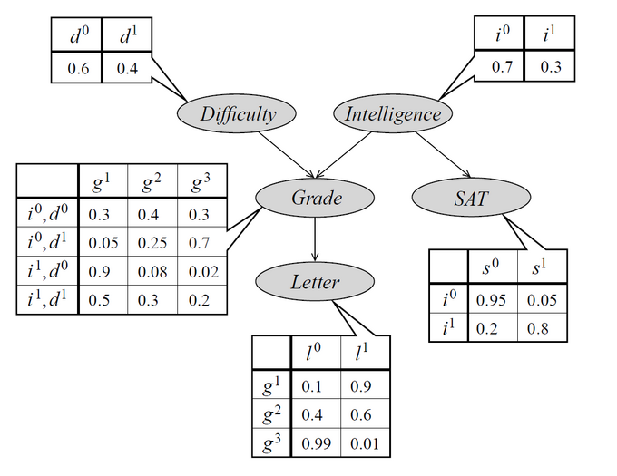

Bayesian network encode the joint distribution as conditional distribution.

$$p(X_{1},X_{2},X_{3}, ...X_{n}) = \prod_{i=1}^{n} p(X_{i} \mid parent(X_{i}))$$

We can factor the joint probability of student network by looking at the graph.

$$p(G,D,I,S,L) = p(G \mid D,I)p(D)p(I) p(S \mid I) p(L \mid G)$$

### Naive bayes (revisit)

                      | Patients number | New China Virus | Fever | Vomitting       |
                      |-----------------|-----------------|-------|-----------------|
                      | 1               | 1               | 1     | 1               |
                      | 2               | 0               | 1     | 0               |
                      | 3               | 1               | 1     | 1               |
                      | 4               | 1               | 1     | 1               |
                      | 5               | 0               | 1     | 1               |
                      | 6               | 0               | 1     | 0               |
                      | 7               | 1               | 0     | 1               |
                      | 8               | 0               | 1     | 0               |
                      | 9               | 1               | 0     | 1               |
                      | 10              | 0               | 1     | 0               |
                      
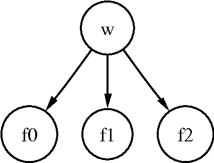{width=300px, height=200px}

Naive Bayes model: 

$$p(W \mid f_{1},f_{2},f_{3}) \propto p(W) \prod_{i} p(f_{i} | W)$$

### Structure in graphical model

In this picture we want to know if B can influence C or C can influence B by given the basic structure of graphical model

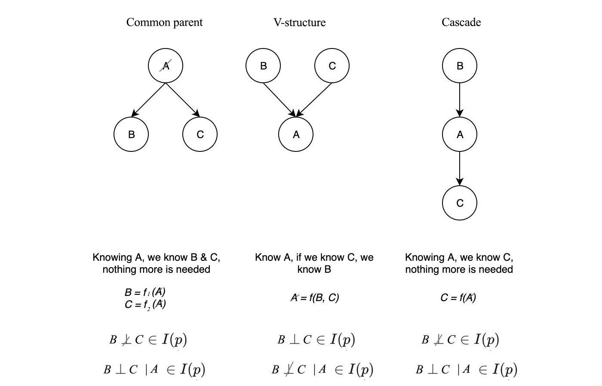

| model            | B can give information about C not given A | B can give information about C given A |
|------------------|--------------------------------------------|----------------------------------------|
| B->A->C          | yes                                        | no                                     |
| C->A->B          | yes                                        | no                                     |
| C->A<-B          | no                                         | yes                                    |
| B<-A->C          | yes                                        | no                                     |

## Programming break (linear regression)

I will show you bayesian approach for linear regression.

$$y =  mx + c$$

$$y = \beta_{1}x + \beta_{2}x^{2} + \beta_{0}$$

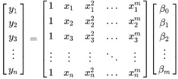

$$Y = X \times W$$

$$X \ -> \ Y \ <- \ W$$

$$p(W \mid X,Y) = \frac{p(W,X,Y)}{p(X,Y)}$$

$$p(W \mid X,Y) \propto p(W,X,Y)$$

$$p(W \mid X,Y) \propto p(W)p(Y \mid W,X)$$

We don't know anything about the actual model of $p(W)$ and $p(Y \mid X,W)$, but we can assume it.

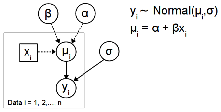

$$p(Y \mid W,X) = \mathcal{N}(Y \mid \mu, \sigma I)$$

$$p(Y \mid W,X) = \mathcal{N}(Y \mid XW, \sigma I)$$

and

$$p(W) = \mathcal{N}(W \mid 0, \gamma I)$$

you get

$$p(W \mid X,Y) \propto p(W)p(Y \mid W,X)$$

$$p(W \mid X,Y) \propto \mathcal{N}(W \mid 0, \gamma I) \mathcal{N}(Y \mid \mu, \sigma I)$$

The multivariate guassian function of Y is

$$\mathcal{N}(Y \mid \mu, \sigma) = \frac{1}{(2 \pi)^{d/2}} | \sigma I |^{-1/2} exp[-\frac{1}{2}(y-\mu)^T (\sigma I)^{-1} (y-\mu)] $$

The multivariate guassian function of W is

$$\mathcal{N}(W \mid \mu, \sigma I) = \frac{1}{(2 \pi)^{d/2}} | \gamma I |^{-1/2} exp[-\frac{1}{2}(w-\mu)^T (\gamma I)^{-1} (w-\mu)]$$

You get

$$\mathcal{N}(W \mid 0, \gamma) \mathcal{N}(Y \mid \mu, \sigma) = \frac{1}{(2 \pi)^{d/2}} | \gamma I |^{-1/2} exp[-\frac{1}{2}(w-\mu)^T (\gamma I)^{-1} (w-\mu)] \frac{1}{(2 \pi)^{d/2}} | \sigma I |^{-1/2} exp[-\frac{1}{2}(y-\mu)^T (\sigma I)^{-1} (y-\mu)]$$

You want to find w that make the function below maximum

$$\frac{1}{(2 \pi)^{d/2}} | \gamma I |^{-1/2} exp[-\frac{1}{2}(w-\mu)^T (\gamma I)^{-1} (w-\mu)] \frac{1}{(2 \pi)^{d/2}} | \sigma I |^{-1/2} exp[-\frac{1}{2}(y-\mu)^T (\sigma I)^{-1} (y-\mu)]$$

take log and find w that give the maximum of below function

$$log C_1  -\frac{1}{2}(w)^T (\gamma I)^{-1} (w) + logC_2 -\frac{1}{2}(y-\mu)^T (\sigma I)^{-1} (y-\mu)$$

$$-> \ -\frac{1}{2}(w)^T (\gamma I)^{-1} (w) -\frac{1}{2} \frac{||y- xw||^2}{\sigma^2}$$

$$=  -\frac{1}{2 \gamma}||w||^2 -\frac{1}{2} \frac{||y- xw||^2}{\sigma^2}$$

$$-> \ -||y- xw||^2 -\lambda||w||^2$$

Find w that give maximum of above function or find the minimum of below function

$$||y- xw||^2 +\lambda||w||^2$$

Let look at $||y- xw||^2$ term


And $\lambda ||w||^2$ term.


$$||y- xw||^2 +\lambda||w||^2 = (y-xw)^T(y-xw) + \lambda w^Tw$$

$$ = y^Ty - 2y^Txw + w^Tx^Txw + \lambda w^Tw$$

When find w that give the function minimum you just differentiate it.

$$\frac{\partial  y^Ty - 2y^Txw + w^Tx^Txw + \lambda w^Tw}{\partial w} = 0$$

$$-2x^Ty + 2x^Txw  + 2\lambda w = 0$$

$$ (2x^Tx  + 2\lambda I )w = 2x^Ty $$

$$ w = (x^Tx  + \lambda I )^{-1} x^Ty $$


## Problem about bayesian inference

Let define the random varibles first

- Evidence variable: $E_{1} = e_{1} ... E_{k} = e_{k}$

- Query variable: $Q$

- Hidden variable: $H_{1} ... H_{r}$

We want $p(Q \mid e_{1} ... e_{k})$

$$p(Q ,e_{1} ... e_{k}) = \sum_{h_{1}...h_{r}}p(Q,h_{1}...h_{r}e_{1}...e_{k})$$

And

$$p(Q \mid e_{1} ... e_{k}) = \frac{p(Q ,e_{1} ... e_{k})}{p(e_{1}...e_{k})}$$

$$p(Q \mid e_{1} ... e_{k}) = \frac{\sum_{h_{1}...h_{r}}p(Q,h_{1}...h_{r}e_{1}...e_{k})}{p(e_{1}...e_{k})}$$

If you have a very large network, it very slow and hard to compute.

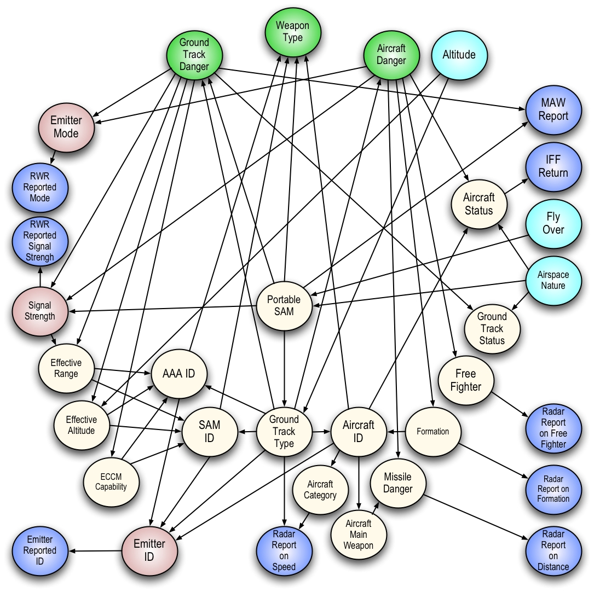{width=500px, height=300px}

### Solution Variable elimination

## Latent variable

## EM algorithm

## Variational inference

## Sampling method


## Python Library

1. PyMC3, PyMC4
2. pyStan
3. pyro
4. Tensorflow probability
5. Edward 2

## Reference

1. https://medium.com/@jonathan_hui
2. https://www.coursera.org/specializations/probabilistic-graphical-models
3. https://www.youtube.com/playlist?list=PLe5rNUydzV9QHe8VDStpU0o8Yp63OecdW
4. http://ai.berkeley.edu/lecture_slides.html

